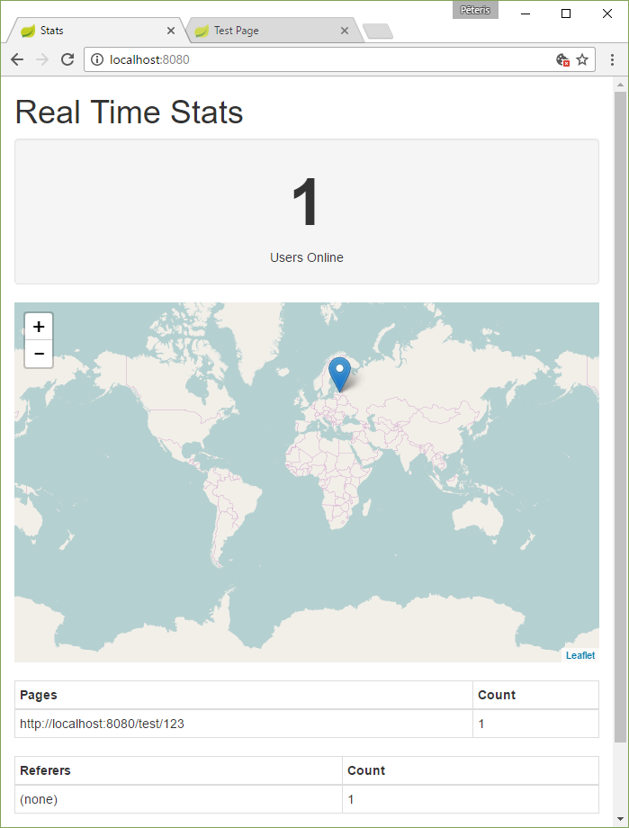

# Real time stats with WebSockets and React

Roll your own alternative to Google Analytics Real Time Statistics.

https://peteris.rocks/blog/real-time-stats-with-websockets-and-react/



## Use

You'll need node.js >= 6.x

Install dependencies.

```
npm install
```

Start the server.

```
node server.js
```

Add the analytics script to your website.

```html
<script src="http://localhost:8080/analytics.js"></script>
```

See the dashboard at [http://localhost:8080/](http://localhost:8080/)

## License

Apache 2.0
